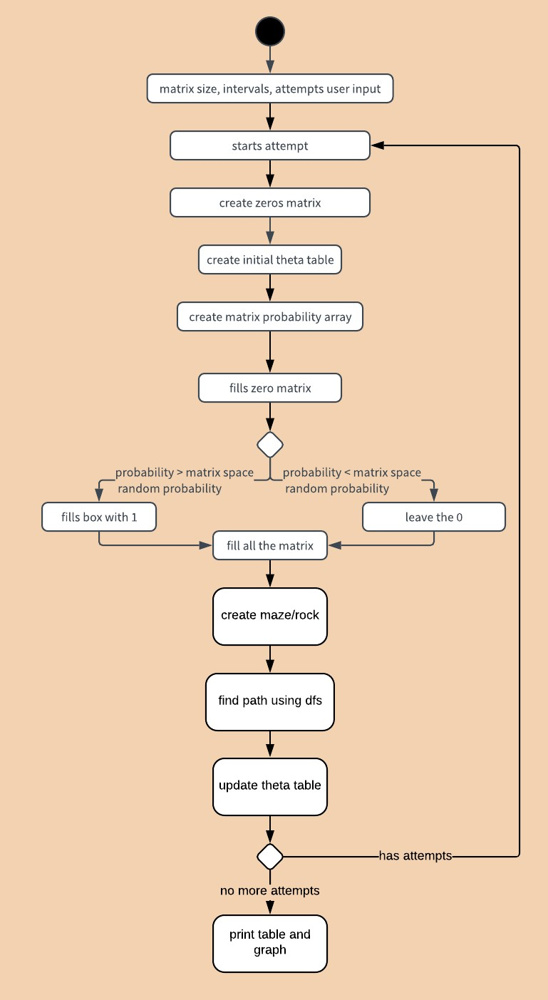
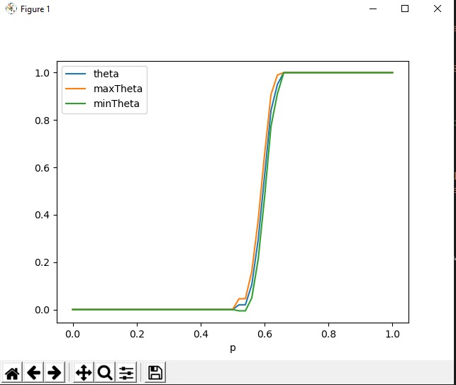
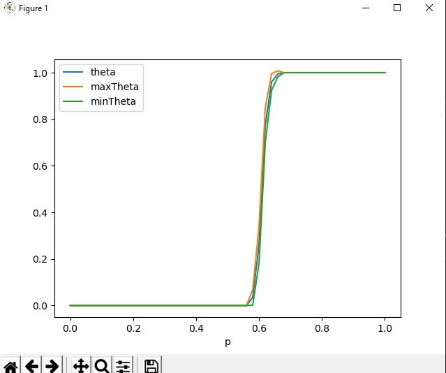
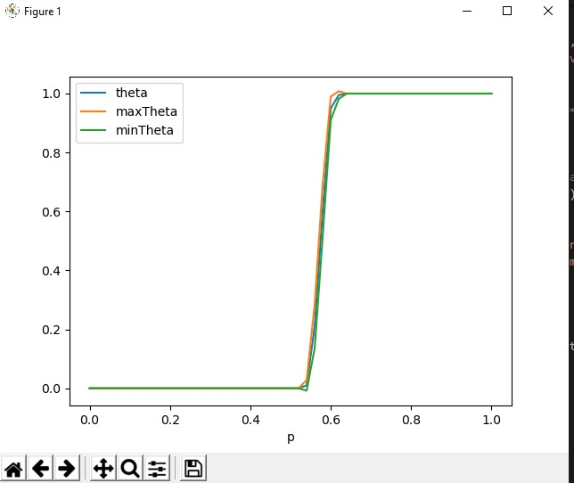
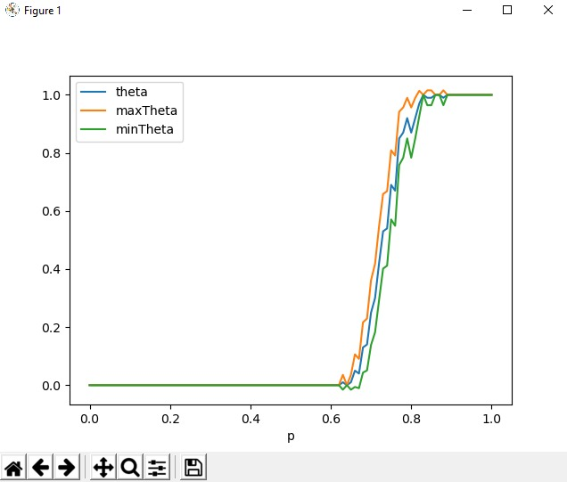

# MANUAL TECNICO QUINTO PUNTO PARCIAL ESTOCÁSTICOS

## Modelos Estocásticos MO2

## Profesor: Jorge Eduardo Ortiz Triviño

## Universidad Nacional De Colombia 2020-1S

## Integrantes

- Nicolas Mateo Casas Ramos
- Daniel Angulo Suescun
- Gabriel David Aguirre Arias

## Diseño General
Se realizó un programa en Python para simular el problema de "La percolación", se necesita instalar las siguientes librerías para su funcionamiento:

- pandas
- numpy
- matplotlib

Esto puede hacerse mediante el uso del los comandos:
        <pre><code>pip install pandas
        pip install numpy
        pip install matplotlib
        </code></pre>
Para realizar una simulacion se debe usar el siguiente comando:
<pre><code>python percolation.py n m [-i or --intervals] number of intervals [-a or --attempts] number of attempts
        </code></pre>

Donde n y m corresponden al tamaño de la matriz a usar.

La programa consiste en tres partes, el percolation el cual contiene la lógica general y coordina las actividades, el mazes el cual se encarga de generar la roca como un conjunto de nodos y el depth-first-search que se encarga de buscar un camino en la roca generada.

el diagrama explica el funcionamiento general del programa

## Resultados obtenidos

- Haciendo uso de una matriz 50 * 50, con 200 iteraciones y intervalos de 0.02 se obtuvo la siguiente tabla:

|FIELD1|p                 |theta|error               |maxTheta           |minTheta             |
|------|------------------|-----|--------------------|-------------------|---------------------|
|0     |0.0               |0.0  |0.0                 |0.0                |0.0                  |
|1     |0.02              |0.0  |0.0                 |0.0                |0.0                  |
|2     |0.04              |0.0  |0.0                 |0.0                |0.0                  |
|3     |0.06              |0.0  |0.0                 |0.0                |0.0                  |
|4     |0.08              |0.0  |0.0                 |0.0                |0.0                  |
|5     |0.1               |0.0  |0.0                 |0.0                |0.0                  |
|6     |0.12              |0.0  |0.0                 |0.0                |0.0                  |
|7     |0.14              |0.0  |0.0                 |0.0                |0.0                  |
|8     |0.16              |0.0  |0.0                 |0.0                |0.0                  |
|9     |0.18              |0.0  |0.0                 |0.0                |0.0                  |
|10    |0.2               |0.0  |0.0                 |0.0                |0.0                  |
|11    |0.22              |0.0  |0.0                 |0.0                |0.0                  |
|12    |0.24              |0.0  |0.0                 |0.0                |0.0                  |
|13    |0.26              |0.0  |0.0                 |0.0                |0.0                  |
|14    |0.28              |0.0  |0.0                 |0.0                |0.0                  |
|15    |0.3               |0.0  |0.0                 |0.0                |0.0                  |
|16    |0.32              |0.0  |0.0                 |0.0                |0.0                  |
|17    |0.34              |0.0  |0.0                 |0.0                |0.0                  |
|18    |0.36              |0.0  |0.0                 |0.0                |0.0                  |
|19    |0.38              |0.0  |0.0                 |0.0                |0.0                  |
|20    |0.4               |0.0  |0.0                 |0.0                |0.0                  |
|21    |0.42              |0.0  |0.0                 |0.0                |0.0                  |
|22    |0.44              |0.0  |0.0                 |0.0                |0.0                  |
|23    |0.46              |0.0  |0.0                 |0.0                |0.0                  |
|24    |0.48              |0.0  |0.0                 |0.0                |0.0                  |
|25    |0.5               |0.0  |0.0                 |0.0                |0.0                  |
|26    |0.52              |0.02 |0.025491199461775037|0.04549119946177504|-0.005491199461775037|
|27    |0.54              |0.02 |0.025491199461775037|0.04549119946177504|-0.005491199461775037|
|28    |0.56              |0.105|0.05581724573888432 |0.1608172457388843 |0.04918275426111567  |
|29    |0.58              |0.295|0.08303626419748783 |0.3780362641974878 |0.21196373580251215  |
|30    |0.6               |0.565|0.09026743209416672 |0.6552674320941667 |0.47473256790583324  |
|31    |0.62              |0.84 |0.06675162919360098 |0.906751629193601  |0.773248370806399    |
|32    |0.64              |0.95 |0.039683415144112805|0.9896834151441127 |0.9103165848558872   |
|33    |0.66              |1.0  |0.0                 |1.0                |1.0                  |
|34    |0.68              |1.0  |0.0                 |1.0                |1.0                  |
|35    |0.7000000000000001|1.0  |0.0                 |1.0                |1.0                  |
|36    |0.72              |1.0  |0.0                 |1.0                |1.0                  |
|37    |0.74              |1.0  |0.0                 |1.0                |1.0                  |
|38    |0.76              |1.0  |0.0                 |1.0                |1.0                  |
|39    |0.78              |1.0  |0.0                 |1.0                |1.0                  |
|40    |0.8               |1.0  |0.0                 |1.0                |1.0                  |
|41    |0.8200000000000001|1.0  |0.0                 |1.0                |1.0                  |
|42    |0.84              |1.0  |0.0                 |1.0                |1.0                  |
|43    |0.86              |1.0  |0.0                 |1.0                |1.0                  |
|44    |0.88              |1.0  |0.0                 |1.0                |1.0                  |
|45    |0.9               |1.0  |0.0                 |1.0                |1.0                  |
|46    |0.92              |1.0  |0.0                 |1.0                |1.0                  |
|47    |0.9400000000000001|1.0  |0.0                 |1.0                |1.0                  |
|48    |0.96              |1.0  |0.0                 |1.0                |1.0                  |
|49    |0.98              |1.0  |0.0                 |1.0                |1.0                  |
|50    |1.0               |1.0  |0.0                 |1.0                |1.0                  |

Gráfica correspondiente al primer caso de prueba

- Haciendo uso de una matriz 150 * 67, con 200 iteraciones y intervalos de 0.02 se obtuvo la siguiente tabla: 
  
FIELD1|p                 |theta|error               |maxTheta           |minTheta             |
|------|------------------|-----|--------------------|-------------------|---------------------|
|0     |0.0               |0.0  |0.0                 |0.0                |0.0                  |
|1     |0.02              |0.0  |0.0                 |0.0                |0.0                  |
|2     |0.04              |0.0  |0.0                 |0.0                |0.0                  |
|3     |0.06              |0.0  |0.0                 |0.0                |0.0                  |
|4     |0.08              |0.0  |0.0                 |0.0                |0.0                  |
|5     |0.1               |0.0  |0.0                 |0.0                |0.0                  |
|6     |0.12              |0.0  |0.0                 |0.0                |0.0                  |
|7     |0.14              |0.0  |0.0                 |0.0                |0.0                  |
|8     |0.16              |0.0  |0.0                 |0.0                |0.0                  |
|9     |0.18              |0.0  |0.0                 |0.0                |0.0                  |
|10    |0.2               |0.0  |0.0                 |0.0                |0.0                  |
|11    |0.22              |0.0  |0.0                 |0.0                |0.0                  |
|12    |0.24              |0.0  |0.0                 |0.0                |0.0                  |
|13    |0.26              |0.0  |0.0                 |0.0                |0.0                  |
|14    |0.28              |0.0  |0.0                 |0.0                |0.0                  |
|15    |0.3               |0.0  |0.0                 |0.0                |0.0                  |
|16    |0.32              |0.0  |0.0                 |0.0                |0.0                  |
|17    |0.34              |0.0  |0.0                 |0.0                |0.0                  |
|18    |0.36              |0.0  |0.0                 |0.0                |0.0                  |
|19    |0.38              |0.0  |0.0                 |0.0                |0.0                  |
|20    |0.4               |0.0  |0.0                 |0.0                |0.0                  |
|21    |0.42              |0.0  |0.0                 |0.0                |0.0                  |
|22    |0.44              |0.0  |0.0                 |0.0                |0.0                  |
|23    |0.46              |0.0  |0.0                 |0.0                |0.0                  |
|24    |0.48              |0.0  |0.0                 |0.0                |0.0                  |
|25    |0.5               |0.0  |0.0                 |0.0                |0.0                  |
|26    |0.52              |0.0  |0.0                 |0.0                |0.0                  |
|27    |0.54              |0.0  |0.0                 |0.0                |0.0                  |
|28    |0.56              |0.0  |0.0                 |0.0                |0.0                  |
|29    |0.58              |0.035|0.03346261790229509 |0.0684626179022951 |0.0015373820977049105|
|30    |0.6               |0.26 |0.07986652145924474 |0.33986652145924473|0.1801334785407553   |
|31    |0.62              |0.775|0.07603338853342655 |0.8510333885334266 |0.6989666114665735   |
|32    |0.64              |0.96 |0.03568024663591889 |0.9956802466359188 |0.9243197533640811   |
|33    |0.66              |0.995|0.012842772164723633|1.0078427721647236 |0.9821572278352764   |
|34    |0.68              |1.0  |0.0                 |1.0                |1.0                  |
|35    |0.7000000000000001|1.0  |0.0                 |1.0                |1.0                  |
|36    |0.72              |1.0  |0.0                 |1.0                |1.0                  |
|37    |0.74              |1.0  |0.0                 |1.0                |1.0                  |
|38    |0.76              |1.0  |0.0                 |1.0                |1.0                  |
|39    |0.78              |1.0  |0.0                 |1.0                |1.0                  |
|40    |0.8               |1.0  |0.0                 |1.0                |1.0                  |
|41    |0.8200000000000001|1.0  |0.0                 |1.0                |1.0                  |
|42    |0.84              |1.0  |0.0                 |1.0                |1.0                  |
|43    |0.86              |1.0  |0.0                 |1.0                |1.0                  |
|44    |0.88              |1.0  |0.0                 |1.0                |1.0                  |
|45    |0.9               |1.0  |0.0                 |1.0                |1.0                  |
|46    |0.92              |1.0  |0.0                 |1.0                |1.0                  |
|47    |0.9400000000000001|1.0  |0.0                 |1.0                |1.0                  |
|48    |0.96              |1.0  |0.0                 |1.0                |1.0                  |
|49    |0.98              |1.0  |0.0                 |1.0                |1.0                  |
|50    |1.0               |1.0  |0.0                 |1.0                |1.0                  |

Gráfica correspondiente al segundo caso de prueba

- Haciendo uso de una matriz 67 * 150, con 200 iteraciones y intervalos de 0.02 se obtuvo la siguiente tabla:

|FIELD1|p                 |theta|error               |maxTheta           |minTheta             |
|------|------------------|-----|--------------------|-------------------|---------------------|
|0     |0.0               |0.0  |0.0                 |0.0                |0.0                  |
|1     |0.02              |0.0  |0.0                 |0.0                |0.0                  |
|2     |0.04              |0.0  |0.0                 |0.0                |0.0                  |
|3     |0.06              |0.0  |0.0                 |0.0                |0.0                  |
|4     |0.08              |0.0  |0.0                 |0.0                |0.0                  |
|5     |0.1               |0.0  |0.0                 |0.0                |0.0                  |
|6     |0.12              |0.0  |0.0                 |0.0                |0.0                  |
|7     |0.14              |0.0  |0.0                 |0.0                |0.0                  |
|8     |0.16              |0.0  |0.0                 |0.0                |0.0                  |
|9     |0.18              |0.0  |0.0                 |0.0                |0.0                  |
|10    |0.2               |0.0  |0.0                 |0.0                |0.0                  |
|11    |0.22              |0.0  |0.0                 |0.0                |0.0                  |
|12    |0.24              |0.0  |0.0                 |0.0                |0.0                  |
|13    |0.26              |0.0  |0.0                 |0.0                |0.0                  |
|14    |0.28              |0.0  |0.0                 |0.0                |0.0                  |
|15    |0.3               |0.0  |0.0                 |0.0                |0.0                  |
|16    |0.32              |0.0  |0.0                 |0.0                |0.0                  |
|17    |0.34              |0.0  |0.0                 |0.0                |0.0                  |
|18    |0.36              |0.0  |0.0                 |0.0                |0.0                  |
|19    |0.38              |0.0  |0.0                 |0.0                |0.0                  |
|20    |0.4               |0.0  |0.0                 |0.0                |0.0                  |
|21    |0.42              |0.0  |0.0                 |0.0                |0.0                  |
|22    |0.44              |0.0  |0.0                 |0.0                |0.0                  |
|23    |0.46              |0.0  |0.0                 |0.0                |0.0                  |
|24    |0.48              |0.0  |0.0                 |0.0                |0.0                  |
|25    |0.5               |0.0  |0.0                 |0.0                |0.0                  |
|26    |0.52              |0.0  |0.0                 |0.0                |0.0                  |
|27    |0.54              |0.01 |0.018116730872318   |0.028116730872318002|-0.008116730872318   |
|28    |0.56              |0.21 |0.07416268224316054 |0.28416268224316055|0.13583731775683944  |
|29    |0.58              |0.605|0.08900993229339633 |0.6940099322933964 |0.5159900677066036   |
|30    |0.6               |0.95 |0.039683415144112805|0.9896834151441127 |0.9103165848558872   |
|31    |0.62              |0.995|0.012842772164723633|1.0078427721647236 |0.9821572278352764   |
|32    |0.64              |1.0  |0.0                 |1.0                |1.0                  |
|33    |0.66              |1.0  |0.0                 |1.0                |1.0                  |
|34    |0.68              |1.0  |0.0                 |1.0                |1.0                  |
|35    |0.7000000000000001|1.0  |0.0                 |1.0                |1.0                  |
|36    |0.72              |1.0  |0.0                 |1.0                |1.0                  |
|37    |0.74              |1.0  |0.0                 |1.0                |1.0                  |
|38    |0.76              |1.0  |0.0                 |1.0                |1.0                  |
|39    |0.78              |1.0  |0.0                 |1.0                |1.0                  |
|40    |0.8               |1.0  |0.0                 |1.0                |1.0                  |
|41    |0.8200000000000001|1.0  |0.0                 |1.0                |1.0                  |
|42    |0.84              |1.0  |0.0                 |1.0                |1.0                  |
|43    |0.86              |1.0  |0.0                 |1.0                |1.0                  |
|44    |0.88              |1.0  |0.0                 |1.0                |1.0                  |
|45    |0.9               |1.0  |0.0                 |1.0                |1.0                  |
|46    |0.92              |1.0  |0.0                 |1.0                |1.0                  |
|47    |0.9400000000000001|1.0  |0.0                 |1.0                |1.0                  |
|48    |0.96              |1.0  |0.0                 |1.0                |1.0                  |
|49    |0.98              |1.0  |0.0                 |1.0                |1.0                  |
|50    |1.0               |1.0  |0.0                 |1.0                |1.0                  |

Gráfica  correspondiente al tercer caso de prueba

- Haciendo uso de una matriz 100 * 10, con 100 iteraciones y intervalos de 0.01 se obtuvo la siguiente tabla:

|FIELD1|p                 |theta|error               |maxTheta           |minTheta             |
|------|------------------|-----|--------------------|-------------------|---------------------|
|0     |0.0               |0.0  |0.0                 |0.0                |0.0                  |
|1     |0.01              |0.0  |0.0                 |0.0                |0.0                  |
|2     |0.02              |0.0  |0.0                 |0.0                |0.0                  |
|3     |0.03              |0.0  |0.0                 |0.0                |0.0                  |
|4     |0.04              |0.0  |0.0                 |0.0                |0.0                  |
|5     |0.05              |0.0  |0.0                 |0.0                |0.0                  |
|6     |0.06              |0.0  |0.0                 |0.0                |0.0                  |
|7     |0.07              |0.0  |0.0                 |0.0                |0.0                  |
|8     |0.08              |0.0  |0.0                 |0.0                |0.0                  |
|9     |0.09              |0.0  |0.0                 |0.0                |0.0                  |
|10    |0.1               |0.0  |0.0                 |0.0                |0.0                  |
|11    |0.11              |0.0  |0.0                 |0.0                |0.0                  |
|12    |0.12              |0.0  |0.0                 |0.0                |0.0                  |
|13    |0.13              |0.0  |0.0                 |0.0                |0.0                  |
|14    |0.14              |0.0  |0.0                 |0.0                |0.0                  |
|15    |0.15              |0.0  |0.0                 |0.0                |0.0                  |
|16    |0.16              |0.0  |0.0                 |0.0                |0.0                  |
|17    |0.17              |0.0  |0.0                 |0.0                |0.0                  |
|18    |0.18              |0.0  |0.0                 |0.0                |0.0                  |
|19    |0.19              |0.0  |0.0                 |0.0                |0.0                  |
|20    |0.2               |0.0  |0.0                 |0.0                |0.0                  |
|21    |0.21              |0.0  |0.0                 |0.0                |0.0                  |
|22    |0.22              |0.0  |0.0                 |0.0                |0.0                  |
|23    |0.23              |0.0  |0.0                 |0.0                |0.0                  |
|24    |0.24              |0.0  |0.0                 |0.0                |0.0                  |
|25    |0.25              |0.0  |0.0                 |0.0                |0.0                  |
|26    |0.26              |0.0  |0.0                 |0.0                |0.0                  |
|27    |0.27              |0.0  |0.0                 |0.0                |0.0                  |
|28    |0.28              |0.0  |0.0                 |0.0                |0.0                  |
|29    |0.29              |0.0  |0.0                 |0.0                |0.0                  |
|30    |0.3               |0.0  |0.0                 |0.0                |0.0                  |
|31    |0.31              |0.0  |0.0                 |0.0                |0.0                  |
|32    |0.32              |0.0  |0.0                 |0.0                |0.0                  |
|33    |0.33              |0.0  |0.0                 |0.0                |0.0                  |
|34    |0.34              |0.0  |0.0                 |0.0                |0.0                  |
|35    |0.35000000000000003|0.0  |0.0                 |0.0                |0.0                  |
|36    |0.36              |0.0  |0.0                 |0.0                |0.0                  |
|37    |0.37              |0.0  |0.0                 |0.0                |0.0                  |
|38    |0.38              |0.0  |0.0                 |0.0                |0.0                  |
|39    |0.39              |0.0  |0.0                 |0.0                |0.0                  |
|40    |0.4               |0.0  |0.0                 |0.0                |0.0                  |
|41    |0.41000000000000003|0.0  |0.0                 |0.0                |0.0                  |
|42    |0.42              |0.0  |0.0                 |0.0                |0.0                  |
|43    |0.43              |0.0  |0.0                 |0.0                |0.0                  |
|44    |0.44              |0.0  |0.0                 |0.0                |0.0                  |
|45    |0.45              |0.0  |0.0                 |0.0                |0.0                  |
|46    |0.46              |0.0  |0.0                 |0.0                |0.0                  |
|47    |0.47000000000000003|0.0  |0.0                 |0.0                |0.0                  |
|48    |0.48              |0.0  |0.0                 |0.0                |0.0                  |
|49    |0.49              |0.0  |0.0                 |0.0                |0.0                  |
|50    |0.5               |0.0  |0.0                 |0.0                |0.0                  |
|51    |0.51              |0.0  |0.0                 |0.0                |0.0                  |
|52    |0.52              |0.0  |0.0                 |0.0                |0.0                  |
|53    |0.53              |0.0  |0.0                 |0.0                |0.0                  |
|54    |0.54              |0.0  |0.0                 |0.0                |0.0                  |
|55    |0.55              |0.0  |0.0                 |0.0                |0.0                  |
|56    |0.56              |0.0  |0.0                 |0.0                |0.0                  |
|57    |0.5700000000000001|0.0  |0.0                 |0.0                |0.0                  |
|58    |0.58              |0.0  |0.0                 |0.0                |0.0                  |
|59    |0.59              |0.0  |0.0                 |0.0                |0.0                  |
|60    |0.6               |0.0  |0.0                 |0.0                |0.0                  |
|61    |0.61              |0.0  |0.0                 |0.0                |0.0                  |
|62    |0.62              |0.0  |0.0                 |0.0                |0.0                  |
|63    |0.63              |0.01 |0.025620926505495467|0.03562092650549547|-0.015620926505495467|
|64    |0.64              |0.0  |0.0                 |0.0                |0.0                  |
|65    |0.65              |0.01 |0.025620926505495467|0.03562092650549547|-0.015620926505495467|
|66    |0.66              |0.05 |0.056120823898086175|0.10612082389808618|-0.006120823898086172|
|67    |0.67              |0.04 |0.05045948870133347 |0.09045948870133347|-0.010459488701333466|
|68    |0.68              |0.13 |0.08659813436212122 |0.21659813436212122|0.04340186563787879  |
|69    |0.6900000000000001|0.14 |0.08934916060042199 |0.229349160600422  |0.050650839399578027 |
|70    |0.7000000000000001|0.25 |0.11150077073724649 |0.3615007707372465 |0.13849922926275351  |
|71    |0.71              |0.3  |0.11800132414511288 |0.4180013241451129 |0.1819986758548871   |
|72    |0.72              |0.42 |0.1270913155963066  |0.5470913155963066 |0.2929086844036934   |
|73    |0.73              |0.53 |0.12851804104871814 |0.6585180410487181 |0.4014819589512819   |
|74    |0.74              |0.54 |0.12833733868208427 |0.6683373386820843 |0.41166266131791573  |
|75    |0.75              |0.69 |0.11909201012242594 |0.8090920101224259 |0.570907989877574    |
|76    |0.76              |0.67 |0.1210797748387401  |0.7910797748387401 |0.5489202251612599   |
|77    |0.77              |0.85 |0.0919458910174892  |0.9419458910174892 |0.7580541089825108   |
|78    |0.78              |0.87 |0.08659813436212122 |0.9565981343621213 |0.7834018656378787   |
|79    |0.79              |0.92 |0.06985799882619025 |0.9898579988261903 |0.8501420011738098   |
|80    |0.8               |0.87 |0.08659813436212122 |0.9565981343621213 |0.7834018656378787   |
|81    |0.81              |0.92 |0.06985799882619025 |0.9898579988261903 |0.8501420011738098   |
|82    |0.8200000000000001|0.97 |0.043926209431272366|1.0139262094312724 |0.9260737905687276   |
|83    |0.8300000000000001|1.0  |0.0                 |1.0                |1.0                  |
|84    |0.84              |0.99 |0.025620926505495478|1.0156209265054954 |0.9643790734945045   |
|85    |0.85              |0.99 |0.025620926505495478|1.0156209265054954 |0.9643790734945045   |
|86    |0.86              |1.0  |0.0                 |1.0                |1.0                  |
|87    |0.87              |1.0  |0.0                 |1.0                |1.0                  |
|88    |0.88              |0.99 |0.025620926505495478|1.0156209265054954 |0.9643790734945045   |
|89    |0.89              |1.0  |0.0                 |1.0                |1.0                  |
|90    |0.9               |1.0  |0.0                 |1.0                |1.0                  |
|91    |0.91              |1.0  |0.0                 |1.0                |1.0                  |
|92    |0.92              |1.0  |0.0                 |1.0                |1.0                  |
|93    |0.93              |1.0  |0.0                 |1.0                |1.0                  |
|94    |0.9400000000000001|1.0  |0.0                 |1.0                |1.0                  |
|95    |0.9500000000000001|1.0  |0.0                 |1.0                |1.0                  |
|96    |0.96              |1.0  |0.0                 |1.0                |1.0                  |
|97    |0.97              |1.0  |0.0                 |1.0                |1.0                  |
|98    |0.98              |1.0  |0.0                 |1.0                |1.0                  |
|99    |0.99              |1.0  |0.0                 |1.0                |1.0                  |
|100   |1.0               |1.0  |0.0                 |1.0                |1.0                  |

Gráfica correspondiente al cuarto caso de prueba

## Análisis de resultados

En la mayoría de casos se puede ver que pasado cierto punto la probabilidad tiende a 1 y que el punto en donde se llega a esa tendencia depende del valor de m*n, entre más bajo este, se necesita una probabilidad mayor para encontrar caminos efectivos, esto se puede observar tanto en las gráficas, como en las tablas, según las gráficas obtenidas se puede decir que se asemeja a una distribución normal o gaussiana.
